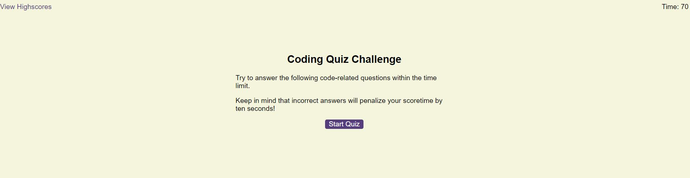
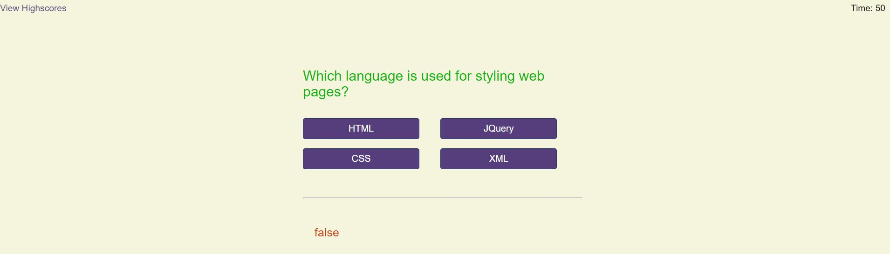
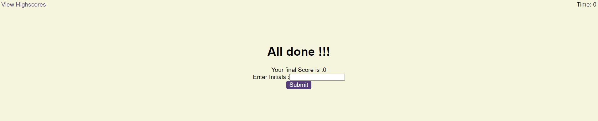
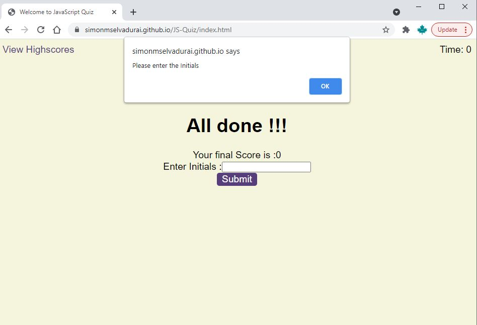
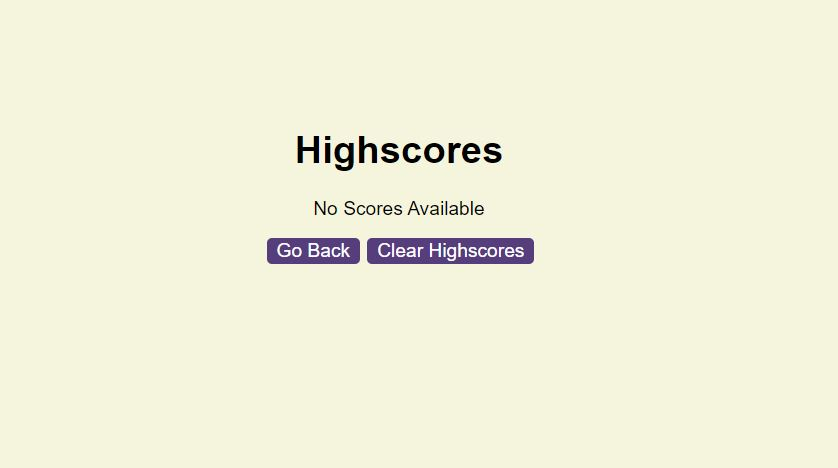
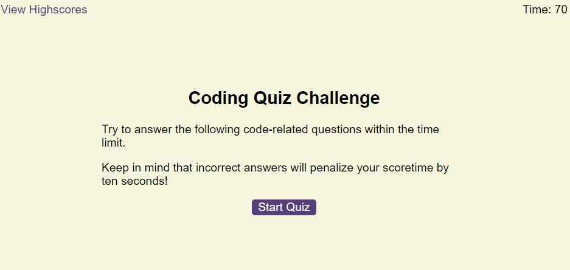

# JS-Quiz

### Description

This Website helps the JavaScript Web-Developers to test their JS knowledge via interactive Quiz.
This helps them to motivate to act very quickly as the score based on the correct answers and quick response.

This website has the timer on the top right corner, scores can be viewed by clicking the link on the left corner.

This project developed using HTML,CSS and Javascript.

Developing this project helps to get much more understaing about the HTML and Java script functions, timers, onload,event listeners

This also helps to get better understanding on various styles in CSS like, Fonts, colors,universal selector, element selector, parent and child element, navbar, header and footer, hover, links,image alignments etc.

# Installation

Source code can be downloaded from https://github.com/SimonMSelvadurai/JS-Quiz
Source code can be cloned 
Https https://github.com/SimonMSelvadurai/JS-Quiz.git
SSH   git@github.com:SimonMSelvadurai/JS-Quiz.git

Application can be launched with the URL https://simonmselvadurai.github.io/JS-Quiz/

### Welcome Page
When the user clicks the github URL, welcome page of the JS-Quiz page will be loaded.
User can see the view highscore menu and timer on the header section. Information/ guidelines on the Quiz is presented in the middle of the page.

While click the start Quiz button, the timer starts decreasing and the quiz is been presented.

index.html is the landing html page for this web-application. User wil see the below screen.

### Quiz Page
User may able to navigate to Questions page by clicking the start quiz button.
Timer will start decreasing, the quiz will be ended once it reached end of all questions or while timer reach 0.
User can choose the option to submit the answers, if the user choose the incorrect answer, then 10 Score/timer will be deducted.
Then user will be presented with next question. Status of the question will show on the bottom of the screen.

### Submit Scores Page
Once the quiz done, scores will be displayed on the screen and user will be prompted to enter their Initials.

Initials is Mandatory field.

### Clear High Scores Screen 

### goback to Home Page

# Usage

# Credits

The following websites was used as reference to build this website.

https://stackoverflow.com/questions

https://developer.mozilla.org/en-US/docs/Web/JavaScript

https://developer.mozilla.org/en-US/docs/Learn/JavaScript/Objects/Object_prototypes
